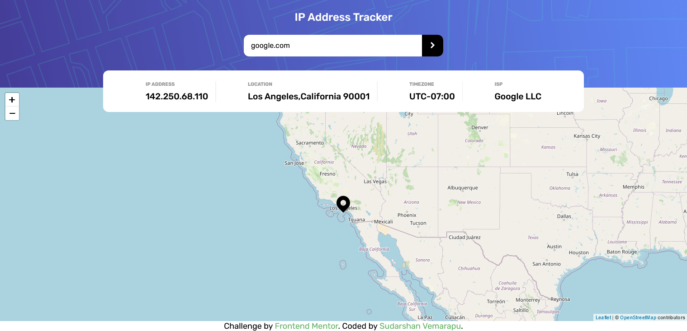
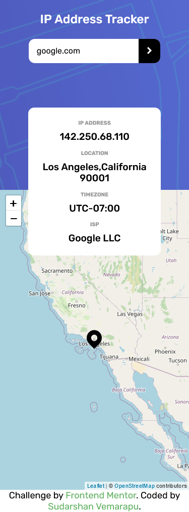

# Frontend Mentor - IP address tracker solution

This is a solution to the [IP address tracker challenge on Frontend Mentor](https://www.frontendmentor.io/challenges/ip-address-tracker-I8-0yYAH0). Frontend Mentor challenges help you improve your coding skills by building realistic projects. 

## Table of contents

- [Overview](#overview)
  - [The challenge](#the-challenge)
  - [Screenshot](#screenshot)
  - [Links](#links)
- [My process](#my-process)
  - [Built with](#built-with)
  - [What I learned](#what-i-learned)
  - [Continued development](#continued-development)
  - [Useful resources](#useful-resources)
- [Author](#author)
- [Acknowledgments](#acknowledgments)

## Overview

### The challenge

Users should be able to:

- View the optimal layout for each page depending on their device's screen size
- See hover states for all interactive elements on the page
- See their own IP address on the map on the initial page load
- Search for any IP addresses or domains and see the key information and location

### Screenshot

### Links

- Solution URL: [solution](https://github.com/sudarshan2718/ip-address-tracker)
- Live Site URL: [live site](https://sudarshan2718.github.io/ip-address-tracker/)

## My process

### Built with

- Semantic HTML5 markup
- CSS custom properties
- Flexbox
- [LeafletJS](https://leafletjs.com/)
- [IP Geolocation API by IPify](https://geo.ipify.org/)
- SCSS

### Useful resources
- [LeafletJS](https://leafletjs.com/)
- [IP Geolocation API by IPify](https://geo.ipify.org/)
## Author

- Frontend Mentor - [@SUDARSHANVEMARAPU](https://www.frontendmentor.io/profile/SUDARSHANVEMARAPU)
- Twitter - [@Sudarshan2718](https://twitter.com/Sudarshan2718)

